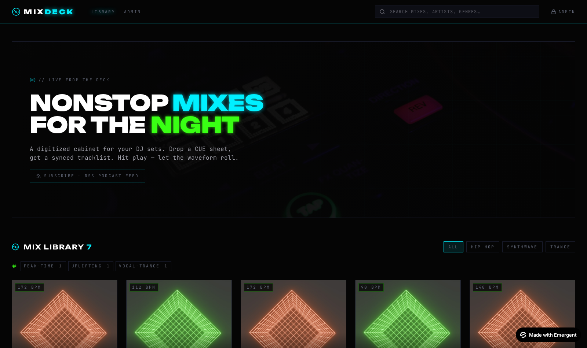
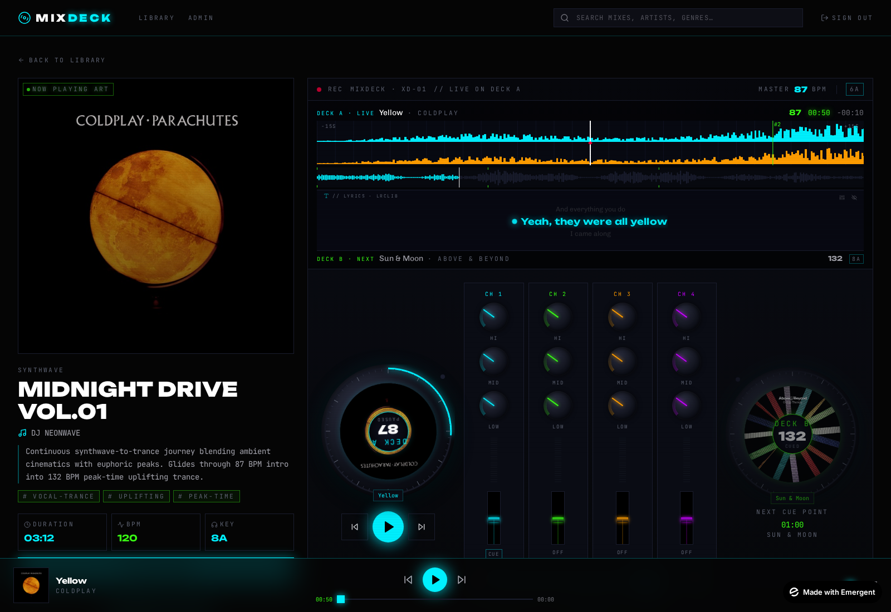

<h1 align="center">MIXDECK</h1>

<p align="center">
  <strong>Self-hosted, cue-aware streaming for continuous DJ mixes — with a real DJ console UI.</strong><br>
  <em>Nonstop mixes. Synced tracklists. Live waveforms. Synced lyrics. Local-AI tagging.</em>
</p>

<p align="center">
  <a href="#features"></a>
  <a href="#tech-stack"></a>
  <a href="#features"></a>
  <a href="#optional-llm-integration"></a>
</p>

---

<p align="center">
  
</p>

<p align="center">
  
</p>

---

## Why MIXDECK?

Most music platforms break continuous DJ mixes into individual tracks, paywalling, fragmenting, or pitch-correcting them. MIXDECK is built **for continuous mixes**: it reads your standard `.cue` sheets, streams the audio in one piece, and surfaces a CDJ-style console UI that respects what a DJ actually built. Drop your library, point MIXDECK at it, and it ingests in place — no copying, no transcoding, no friction.

## Features

### Audio + library
- **`.cue` sheet parser** — full standard, multi-timestamp aware, latin-1/utf-8 fallback
- **In-place library ingest** — bulk scan a directory (recursive) and reference your `.mp3` / `.flac` / `.wav` / `.m4a` / `.ogg` / `.opus` **without copying or transcoding**
- **HTTP-Range streaming** — instant seek, native browser scrub bar, mobile-friendly
- **Auto cover-art lookup** — cascading iTunes → MusicBrainz → Discogs (with optional API key)
- **Auto BPM + musical key analysis** — `librosa` + `mutagen`, Camelot wheel notation for harmonic mixing
- **Real audio-decoded waveforms** — computed once per mix, cached to disk + Redis

### DJ Console UI
- **CDJ-style twin jog wheels** with rotating cover-art discs + drag-scrub (±5s on 60° drag)
- **Dual waveform display** — cyan/orange stereo bands, zoomed (30s window) + full-mix overview with cue markers
- **4-channel mixer** with hi/mid/low EQ knobs that breathe with analyser band energy
- **Master volume + crossfader** with neon tick marks
- **Performance pads** — paginated banks of 8 hot-cues; auto-flips to the active bank in 100+ track mixes
- **Synchronized lyrics HUD** — `LRCLIB.net` powered (free, no key), inline between waveform and deck preview, with BPM-synced pulsing dot, per-track ±5s sync offset, eye-off toggle

### Listener features
- **Deep-seek share links** — `?t=MM:SS` jumps directly to a moment in the mix
- **OpenGraph rich previews** — links pasted into Discord / iMessage / Twitter / Slack render cover art + title cards
- **Embeddable iframe player** — drop a 600×180 `<iframe>` snippet into any blog or Linktree
- **"More like this" recommendations** — BPM proximity + Camelot adjacency + shared-tag scoring
- **Resume-where-you-left-off** — every 5s the player saves position to localStorage; come back to a green RESUME banner
- **MediaSession integration** — phone lock-screen, Bluetooth, CarPlay, Android Auto controls with live track metadata + artwork

### Admin
- **Password-gated `/admin`** with JWT (no external auth dependency)
- **Bulk directory scan** with background task + live progress (no timeouts on 1000+ file libraries)
- **Library-wide analysis overview** — `ANALYZED 87/124 · 70%` header strip + one-click `ANALYZE ALL`
- **Inline metadata editor** with manual key / Camelot / BPM / description / tags fields
- **AI auto-generated descriptions + tags** (uses your own local LLM — see [LLM integration](#optional-llm-integration))
- **Bulk AI runs** — `AUTO-TAG ALL` / `AUTO-METADATA ALL` walk the whole library in the background
- **RSS / podcast feed** at `/api/feed.xml` — subscribe in Apple Podcasts, Overcast, etc.

---

## Tech stack

| Layer    | Stack |
|----------|-------|
| Frontend | React 19 · TailwindCSS · Shadcn UI · Lucide · Sonner toasts |
| Backend  | FastAPI · Motor (async MongoDB) · `librosa` · `mutagen` · `httpx` |
| Database | MongoDB |
| Cache    | Redis (optional — falls back gracefully if absent) |
| AI       | Bring-your-own OpenAI-compatible endpoint (SGLang / Ollama / vLLM / LM Studio) |

---

## Quick start (Docker recommended)

> **Prereqs:** Docker + Docker Compose, OR Node 20+ / Python 3.11+ / MongoDB 6+ for native install.

### 1. Clone

```bash
git clone https://github.com/<you>/mixdeck.git
cd mixdeck
```

### 2. Configure environment

Create `backend/.env`:

```env
MONGO_URL="mongodb://mongo:27017"
DB_NAME="mixdeck"
CORS_ORIGINS="*"

# Admin login - CHANGE BOTH OF THESE
ADMIN_PASSWORD="change-me-now"
JWT_SECRET="any-long-random-string-128-chars"

# Optional - upgraded artwork coverage for whitelabel/trance releases
DISCOGS_TOKEN=""

# Optional - Redis for caching (will fall back to in-memory if missing)
REDIS_URL="redis://redis:6379/0"
CACHE_TTL="300"

# Optional - default local LLM endpoint (admin can change at runtime in Settings)
LLM_BASE_URL="http://host.docker.internal:30000/v1"
LLM_MODEL="default"
LLM_API_KEY=""
LLM_BULK_CONCURRENCY="2"
```

Create `frontend/.env`:

```env
REACT_APP_BACKEND_URL="http://localhost:8001"
```

### 3. Run

**Docker Compose** (recommended):

```bash
docker compose up -d
```

**Or natively:**

```bash
# Backend
cd backend
pip install -r requirements.txt
uvicorn server:app --host 0.0.0.0 --port 8001

# Frontend (new terminal)
cd frontend
yarn install
yarn start
```

Visit `http://localhost:3000`. Log in at `/admin` with the password you set above.

### 4. Add your first mix

1. Open the **`/admin`** dashboard → click **BULK SCAN**
2. Enter the absolute path to your DJ-mix directory (e.g. `/srv/dj-mixes`)
3. Tick **AUTO BPM + KEY ANALYSIS** if you want librosa to fingerprint every track
4. Click **SCAN NOW** — progress streams live; thousands of files are fine

MIXDECK reads `MixName.cue` next to each audio file. Cover art is sourced from:
1. Adjacent file (`MixName.jpg`, `folder.jpg`, `cover.png`)
2. iTunes Search API
3. MusicBrainz / Cover Art Archive
4. Discogs (requires token)

Your audio is **never copied**. MIXDECK streams directly from the source path.

---

## Optional: LLM integration

MIXDECK can use a **local LLM** (SGLang, Ollama, vLLM, LM Studio — anything that speaks the OpenAI `/v1/chat/completions` API) for:

- 2–4 sentence vibey **mix descriptions** generated from the tracklist + BPM/key data
- 4–7 mood/vibe/sub-genre **tags** (`peak-time`, `vocal-trance`, `after-hours`, etc.)
- Bulk operations that walk the whole library

### Setup

1. Start your local LLM server (example with SGLang):
   ```bash
   python -m sglang.launch_server --model meta-llama/Llama-3.2-3B-Instruct --port 30000
   ```
2. Log into MIXDECK → **Admin → Settings**
3. Set **BASE URL** to `http://localhost:30000/v1`, set **MODEL NAME**, leave API key empty
4. Click **TEST CONNECTION** — should turn green with model list
5. From any mix's edit modal, click **✨ AI GENERATE** for descriptions or **✨ AI TAG** for tags
6. For library-wide ops, on the Settings page hit **AUTO-TAG ALL** / **AUTO-METADATA ALL**

> All LLM features fail gracefully if no LLM is configured — the rest of the app works fine without it.

---

## Endpoint reference

### Public

| Method | Path | Description |
|--------|------|-------------|
| `GET` | `/api/mixes?q=&genre=&tag=` | Library listing with optional filters |
| `GET` | `/api/mixes/{id}` | One mix's full metadata |
| `GET` | `/api/mixes/{id}/compatible` | "More like this" (BPM + Camelot + tag scoring) |
| `GET` | `/api/mixes/tags` | Tag cloud with counts |
| `GET` | `/api/mixes/genres` | Distinct genre list |
| `GET` | `/api/stream/{id}` | Audio streaming with HTTP Range |
| `GET` | `/api/cover/{id}` | Mix cover art |
| `GET` | `/api/mixes/{id}/waveform` | Decoded waveform peaks (cached) |
| `GET` | `/api/mixes/{id}/analysis_status` | BPM + key analysis state |
| `GET` | `/api/tracks/artwork?artist=&title=` | Single-track artwork lookup (iTunes→MB→Discogs) |
| `GET` | `/api/tracks/lyrics?artist=&title=&duration=` | Synced LRC lyrics from LRCLIB |
| `GET` | `/api/share/{id}` | OpenGraph share page (auto-redirects humans) |
| `GET` | `/api/embed/{id}` | Embeddable iframe player |
| `GET` | `/api/feed.xml` | RSS / podcast feed |

### Admin (`Bearer <jwt>` required)

| Method | Path | Description |
|--------|------|-------------|
| `POST` | `/api/auth/login` | Returns a 30-day JWT |
| `POST` | `/api/admin/scan` | Start bulk-scan background task |
| `GET` | `/api/admin/scan/{task_id}` | Poll scan progress |
| `GET` | `/api/admin/analysis_overview` | Library-wide analysis counters |
| `POST` | `/api/admin/analyze_all` | Queue analysis for the entire library |
| `POST` | `/api/admin/mixes/{id}/analyze` | Queue analysis for one mix |
| `PATCH` | `/api/admin/mixes/{id}` | Edit metadata / tracks / tags |
| `DELETE` | `/api/admin/mixes/{id}` | Remove a mix |
| `POST` | `/api/admin/mixes/{id}/generate_description` | LLM description |
| `POST` | `/api/admin/mixes/{id}/generate_tags` | LLM tags |
| `POST` | `/api/admin/llm/auto_tag_all` | Bulk LLM tags background task |
| `POST` | `/api/admin/llm/auto_describe_all` | Bulk LLM descriptions background task |
| `GET` | `/api/admin/llm/bulk/{task_id}` | Poll bulk-LLM progress |
| `GET` | `/api/admin/settings` / `PATCH` | Runtime LLM config |
| `POST` | `/api/admin/settings/test_llm` | LLM endpoint health-check |

---

## Architecture

```
┌─────────────────────────────────────────────────────────────────────┐
│                        FastAPI backend (port 8001)                  │
├─────────────────────────────────────────────────────────────────────┤
│  server.py          → composer: routes only                         │
│  state.py           → DB client + storage paths + env defaults      │
│  models.py          → Pydantic Mix / Track / Settings types         │
│  cue.py             → CUE parser + cover-file discovery             │
│  artwork.py         → iTunes → MusicBrainz → Discogs cascade        │
│  lyrics_service.py  → LRCLIB.net + LRC parser + Mongo cache         │
│  analysis_service.py→ librosa BPM/key/peaks worker pool             │
│  scan_service.py    → bulk directory scan w/ task tracking          │
│  llm_service.py     → OpenAI-compatible chat client                 │
│  llm_bulk_service.py→ AUTO-TAG-ALL / AUTO-DESCRIBE-ALL queues       │
│  settings_service.py→ runtime LLM config (Mongo-persisted)          │
│  audio_analysis.py  → librosa primitives (called via run_in_executor)│
│  cache.py           → Redis wrapper (graceful no-op if down)        │
└─────────────────────────────────────────────────────────────────────┘
                  │                                  │
                  ▼                                  ▼
              ┌──────────┐                  ┌───────────────────┐
              │ MongoDB  │                  │  Redis (optional) │
              └──────────┘                  └───────────────────┘
                                                    │
┌─────────────────────────────────────────────────────────────────────┐
│                        React frontend (port 3000)                   │
├─────────────────────────────────────────────────────────────────────┤
│  pages/Library          → Tag-cloud filter, genre tabs, mix grid    │
│  pages/MixDetail        → Player, share, embed, resume banner       │
│  pages/AdminDashboard   → CRUD, analysis overview, settings link    │
│  pages/AdminSettings    → LLM endpoint config + bulk AI runners     │
│  contexts/PlayerContext → Global audio state, MediaSession, resume  │
│  components/dj/*        → DJ Console: jog wheels, mixer, waveform,  │
│                            crossfader, performance pads,            │
│                            LyricsDisplay HUD                        │
└─────────────────────────────────────────────────────────────────────┘
```

## Data model

```js
Mix {
  id, title, artist, genre, description,
  bpm, key, camelot, duration,
  tags: ["uplifting", "vocal-trance", "peak-time"],
  source_path: "/srv/dj-mixes/TRANCEHYPE2025.mp3",
  source_cover_path: "/srv/dj-mixes/TRANCEHYPE2025.jpg",
  analysis_status: "done",
  tracks: [
    { index, title, artist, start_seconds, bpm, key, camelot }
  ],
  play_count, created_at
}
```

---

## Self-hosting checklist

- [ ] **Strong `ADMIN_PASSWORD` and long-random `JWT_SECRET`** in `backend/.env`
- [ ] **Reverse proxy with HTTPS** in front (Caddy / Traefik / nginx)
- [ ] **Mount your DJ-mix directory** as a volume in Docker (read-only is fine)
- [ ] **Configure `REACT_APP_BACKEND_URL`** to your public origin if frontend is a separate host
- [ ] Optionally **expose `/api/feed.xml`** so listeners can subscribe in Apple Podcasts / Overcast
- [ ] Optionally **point Settings → LLM at your local model** for AI features
- [ ] Set up **monitoring** on `/api/` (any 404 on `/api/` is suspicious)

## Performance notes

- `librosa` audio analysis is CPU-heavy. Concurrency is capped by an `asyncio.Semaphore`; tune via `ANALYSIS_CONCURRENCY` env (default 2). Use `LLM_BULK_CONCURRENCY` for bulk AI ops.
- Waveform peaks are computed **once** per mix, cached to `backend/storage/waveforms/{id}.json` and Redis.
- Lyrics, artwork, and "more like this" results are negative-cached (failures cached too) to avoid hammering upstream APIs.
- Redis is **optional** — without it, FastAPI handles caching in-process. With it, you'll see roughly 10× faster library responses.

## Roadmap

See `memory/PRD.md` for the full implementation log + backlog. Highlights:

- **P2** — Listener favorites + global like counts + live "now playing" counter
- **P2** — Per-mix listener analytics (drop-off curves, completion %)
- **🔥** — Smart Playlist / Auto-Setlist Builder (chain compatible mixes into a continuous all-night flow)
- **🔥** — Listener heat-map on the waveform (where listeners cluster in real-time)
- **P2** — Mobile DJ console refinement
- **P2** — Karaoke-mode lyric overlay (full-page progressive highlighting)

## Contributing

Pull requests welcome. The codebase favours:

- **Small, focused modules** — `server.py` is intentionally a slim composer, all heavy logic lives in dedicated `*_service.py` files
- **Pydantic at the boundary** — never return Mongo docs raw, always wrap in `Mix(**doc)`
- **Cache invalidation on every write** — see `cache.invalidate_mixes()`; new endpoints that mutate must call it
- **`data-testid` on every interactive element** for end-to-end testing

Run the test suite before submitting:

```bash
cd backend/tests
pytest -q
```

127 tests, ~17s on a laptop. CI-friendly.

## License

MIT — do whatever you want with it, just don't claim you wrote it from scratch.

## Credits

- **LRCLIB.net** — open lyrics database (no API key, free, please consider donating)
- **iTunes / MusicBrainz / Discogs** — cover-art sources
- **`librosa`** — audio fingerprinting
- **Camelot wheel** — harmonic mixing notation by Mark Davis
- Built with [Emergent](https://emergent.sh) — vibe-coded full-stack platform

---

<p align="center">
  <em>MIXDECK · for the night that doesn't stop.</em>
</p>
